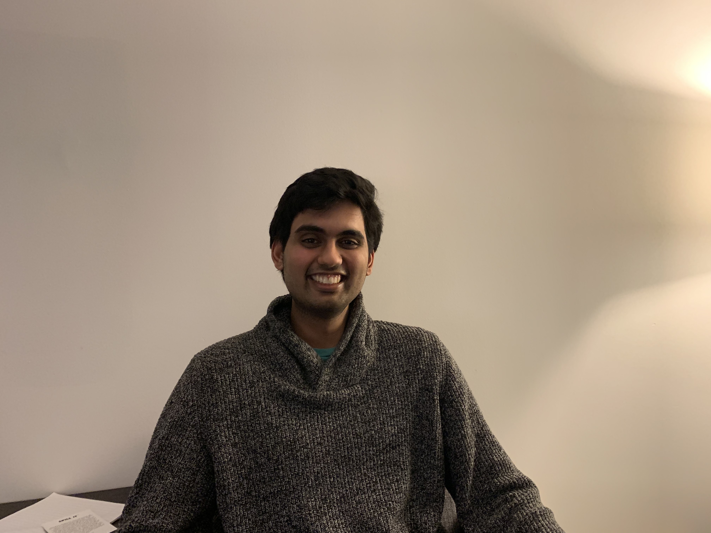

# Hi There! 

I'm an undergraduate math major at the University of Chicago, and president and founder of the [UChicago Applied Mathematics Club (UCAMC)](https://ucamc.github.io/). Here are some of the expository papers I have written:

- [An Introduction to Brownian Motion](/An_Introduction_to_Brownian_Motion (2).pdf)
- [The Fourier Operator and The Characteristic Function](/Bootcamp_Probability_Lecture.pdf)
- [A Brief Introduction to Differential Forms in R^n and the Gauss-Bonnet Theorem](/Nanavaty_FINAL.pdf)
- [Qualitative and Quantitative Analysis of Autonomous ODE's](/Bootcamp_ODE_Lecture_7_3_18.pdf)

Also, here's my football [highlight tape](
https://www.youtube.com/watch?v=bJxFgyZ5KGE&feature=youtu.be).

## 
